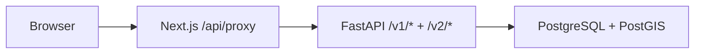

# ARCHITECTURE

`kor-travel-geo-ui`는 자체 DB 연결 없이 Next.js Route Handler가 `kor-travel-geo` REST API를 프록시한다.

주요 화면은 디버그(`/debug/*`)와 운영(`/admin/*`)으로 나뉜다. 지오코딩/역지오코딩 디버그 화면은 `/v2/geocode`, `/v2/reverse`를 사용하고, 운영·정규화·EXPLAIN 화면은 `/v1/admin/*`를 사용한다. `types/api.gen.ts`는 루트 `openapi.json`에서 생성하고, 손수 작성하는 입력 검증은 `lib/schemas.ts`에 둔다.

공통 UI는 [DESIGN-RULES.md](DESIGN-RULES.md)의 StyleSeed 기반 운영 콘솔 규칙을 따른다.
새 화면은 먼저 semantic token, 8px 카드 반경, 낮은 그림자, 44px 조작 대상, 상태 dot+text
표현을 확인한 뒤 필요한 컴포넌트만 추가한다.
